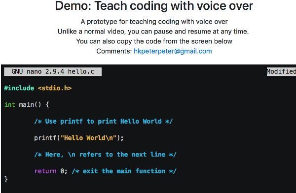

## codetube-demo

Combine asciinema with Voice API

Tools:
- [asciinema-player](https://github.com/asciinema/asciinema-player) JS player after recording via asciinema
- [easytimer](https://github.com/albert-gonzalez/easytimer.js/) Easier to use than native timer API
- [Bootstrap 4](https://getbootstrap.com/) Responsive layout
- [Web Speech API](https://developer.mozilla.org/en-US/docs/Web/API/Web_Speech_API)
  - Desktop: Chrome 33+, Firefox 49+, Safari 7+
  - Mobile: not sure how to make it work

Demo: [https://hkpeterpeter.github.io/codetube-demo/](https://hkpeterpeter.github.io/codetube-demo/)
2nd Demo: [https://hkpeterpeter.github.io/codetube-demo/gcc.html](https://hkpeterpeter.github.io/codetube-demo/gcc.html)

